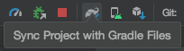
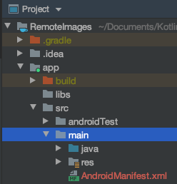
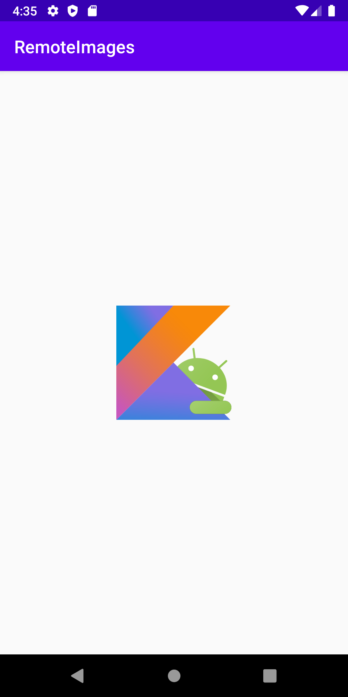

[`Kotlin Intermedio`](../../Readme.md) > [`Sesión 01`](../Readme.md) > `Ejemplo 3`

## Ejemplo 3: Imágenes mediante URL

<div style="text-align: justify;">

### 1. Objetivos :dart:

- Instalar dependencias mediante _gradle_
- extender _ImageView_ para recuperar imágenes por medio de una URL.

### 2. Requisitos :clipboard:

1. Android Studio Instalado en nuestra computadora.
2. Seguir la instrucciones específicas para esta sesión.

### 3. Desarrollo :computer:

1. Insertamos la implementación de la dependencia en el archivo ___app/buid.grade___ la siguiente línea:

    ```gradle
    dependencies{
        implementation(libs.coil)
    }
    ```

    nótese que esta línea va dentro del bloque ___dependencies___, aquí es donde se declara la implementación de dependencias de la app. Cada dependencia se vaja de un repositorio.

2. Con todos los cambios hechos en ___gradle___, sincronizamos nuestro proyecto. Cada vez que se modifican los archivos ___gradle___, emerge esta barra superior: 


Podemos dar click en ___Sync now___ en la parte derecha de esa barra, o sincronizamos mediante la herramienta (dicha opción es un elefante con una flecha azul).



4. Requeriremos permisos de internet, por lo que entramos al manifest en ___app/src/main/AndroidManifest.xml___ e insertamos el permiso:

    ```xml
    <uses-permission android:name="android.permission.INTERNET"/>
    ```

    

5. Utiliza el siguiente código para sustituir el _ViewGroup_ actual por _LinearLayout_.

   ```xml
   <?xml version="1.0" encoding="utf-8"?>
   <LinearLayout xmlns:android="http://schemas.android.com/apk/res/android"
      xmlns:app="http://schemas.android.com/apk/res-auto"
      xmlns:tools="http://schemas.android.com/tools"
      android:layout_width="match_parent"
      android:gravity="center"
      android:layout_height="match_parent"
      android:orientation="vertical"
      tools:context=".MainActivity">
      {COLOCA AQUI EL CONTENIDO DEL LAYOUT}
   </LinearLayout>
   ```

6. Dentro del _LinearLayout_, insertar el siguiente _ImageView_:

    ```xml
    <ImageView
        android:id="@+id/imageView"
        android:layout_width="130dp"
        android:layout_height="130dp"
    />
    ```

7. Por último, agregamos la variable para el _ImageView_.

    ```kotlin
    private lateinit var imageView: ImageView
    ```

    asignamos valor a un campo:

    ```kotlin
    imageView = findViewById(R.id.imageView)
    ```

    y utilizamos la función _load_ (es un método que extiende de _ImageView_) para cargar imágenes desde URLS etc.

    ```kotlin
    imageView.load("https://raw.githubusercontent.com/beduExpert/Kotlin-Intermedio-GN/master/images/android-kotlin.png")
    ```

    Corremos el código y comprobamos!

    


[`Anterior`](../Reto-02/Readme.md) | [`Siguiente`](../Proyecto/Readme.md)

</div>
