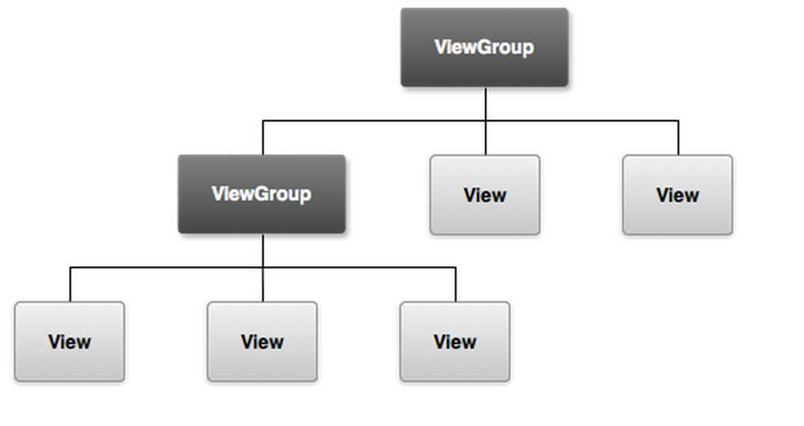

[`Kotlin-Intermedio`](../Readme.md) > `Sesión 1`


## Sesión 1: Views

<div style="text-align: justify;">

### Introducción

Un __View__ es una clase que representa la base de todos los componentes para la interfaz gráfica y su representación gráfica está delimitada por un rectángulo. La descripción gráfica de un View así como su posición en la pantalla está determinado por un archivo layout en lenguaje __XML__. Un tipo especial de View es el __ViewGroup__, que es un contenedor de Views y otros ViewGroups con un formato de orden específico, que se encuentran distribuidos jerárquicamente en un árbol de Vistas.

### Instrucciones de la sesión

Para esta sesión, modificaremos el layout inicial de un proyecto creado, de modo que el archivo generado en ___res/layout___ sea reemplazado por este código:

```xml
<?xml version="1.0" encoding="utf-8"?>
<LinearLayout xmlns:android="http://schemas.android.com/apk/res/android"
    xmlns:app="http://schemas.android.com/apk/res-auto"
    xmlns:tools="http://schemas.android.com/tools"
    android:layout_width="match_parent"
    android:gravity="center"
    android:layout_height="match_parent"
    android:orientation="vertical"
    tools:context=".MainActivity">
     {COLOCA AQUI EL CONTENIDO DEL LAYOUT}
</LinearLayout>
```


<h5>Ejemplo de árbol de Views</h5>

### 1. Objetivos :dart: 

---


- Identificar los controles esenciales para generar interfaces básicas 
- Utilizar herramientas básicas para debugge
- Implementar los controles y herramientas para modificar el proyecto por defecto

### 2. Contenido :blue_book:

---

 

#### <ins>Textos y botones</ins>

Se crearán textos y botones desde cero mediante código.

En esta sección exploraremos dos de los componentes más comunes dentro de los programas que usan interfaces gráficas de usuario:
El texto fijo que el usuario no puede modificar y que se utiliza para mostrar instrucciones y/o información importante. 
El botón: un componente que el usuario utiliza para pulsar y disparar un evento, es decir que realizará alguna acción en la aplicación.
Ambos elementos tienen atributos modificables como margen, borde y padding, entre otros.

En el siguiente ejemplo crearás textos y botones desde cero mediante código.

- [**`EJEMPLO 1`**](Ejemplo-01/Readme.md)
- [**`RETO 1`**](Reto-01/Readme.md)

---

 

#### <ins>EditText e imágenes</ins>

Las “Entradas de texto” o Edit text son un elemento importante para crear una mejor experiencia al usuario, ya que le permiten ingresar un texto desde el teclado del móvil y, a través de ello, detonar diferentes eventos.

Asimismo, la visualización de imágenes es imprescindible, por lo que en el siguiente ejemplo y reto, ampliaremos el dominio ImageViews. 

- [**`EJEMPLO 2`**](Ejemplo-02/Readme.md)
- [**`RETO 2`**](Reto-02/Readme.md)

---

 

#### <ins>Imágenes mediante URL</ins>

Para que un ImageView pueda cargar una imagen remota a través de una URL, tenemos que instalar alguna dependencia (o descargarla con un cliente y asignarla, pero eso es mucho más complicado). Las opciones más populares son:

- Fresco
- Picasso
- Glide

Mientras que todos los anteriores tienen una amplia comunidad, nos enfocaremos en una cuarta opción: coil ( Coroutine Image Loader), que como dice su nombre, utiliza las populares coroutines de Kotlin. 

- [**`EJEMPLO 3`**](Ejemplo-03/Readme.md)

---


### 3. Proyecto :hammer:

Con los temas anteriores, construye una pantalla de login y register para la aplicación definida.

- [**`PROYECTO SESIÓN 1`**](Proyecto/Readme.md)

<br/>

[`Anterior`](../Sesion-01/Readme.md) | [`Siguiente`](../Sesion-02/Readme.md)      

</div>

