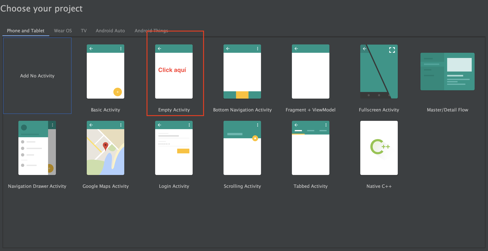

[`Kotlin Intermedio`](../../Readme.md) > [`Sesión 02`](../Readme.md) > `Ejemplo 4`

## Ejemplo 4: Ciclo de vida de un Activity

<div style="text-align: justify;">

### 1. Objetivos :dart:

- Analizar el ciclo de vida de un activity a través de indicadores visual para corroborar el orden en el flujo estudiado

### 2. Requisitos :clipboard:

1. Android Studio Instalado en nuestra computadora.
2. Seguir la instrucción específica para esta sesión.

### 3. Desarrollo :computer:

Como estudiamos anteriormente, cada estado del ciclo de un Activity ejecuta ciertas tareas para correr/finalizar procesos, y se pueden sobreescribir para inicializar la lógica de negocio en la pantalla. En este ejercicio vamos a confirmar el orden en el flujo previamente estudiado. 

Nos apoyaremos de un elemento visual llamado **Toast**

Para realizar el ejemplo, seguimos los siguientes pasos:

1. Creamos un nuevo proyecto con una Activity vacía.

    

2. Ingresamos el siguiente nombre y package name para el proyecto

    

3. Al crearse el proyeccto, abrir la ventana MainActivity, en ella encontraran esto:

    ```kotlin
    override fun onCreate(savedInstanceState: Bundle?) {
        super.onCreate(savedInstanceState)
        setContentView(R.layout.activity_main)
    }
    ```
    > No hay que olvidar que la sentencia *override* es un modificador que sirve para sobreescribir un método implementado por la clase que se hereda.

    Bajo esta función, hacer override de los otros métodos llamados durante el ciclo de vida de un Activity, e insertar en ellas el Toast con un texto que identifique en el estado del ciclo en que unon se encuentra.

    ```kotlin
    override fun onCreate(savedInstanceState: Bundle?) {
        super.onCreate(savedInstanceState)
        setContentView(R.layout.activity_main)
        
        Log.d("activities","onCreate ejecutado")
    }

    override fun onStart() {
        super.onStart()
        Log.d("activities","onStart ejecutado")
    }

    override fun onResume() {
        super.onResume()
        Log.d("activities","onResume ejecutado")
    }

    override fun onPause() {
        Log.d("activities","onPause ejecutado")
        super.onPause()
    }

    override fun onStop() {
        Log.d("activities","onStop ejecutado")
        super.onStop()
    }

    override fun onRestart() {
        super.onRestart()
        Log.d("activities","onRestart ejecutado")
    }

    override fun onDestroy() {
        Log.d("activities","onDestroy ejecutado")
        super.onDestroy()
    }
    ```

4. Después de esto, ejecutamos la aplicación y comprobamos el flujo. Describe qué métodos se mandan a llamar cuando la aplicación se minimiza y cuando se cierra.

5. Comprobar qué sucede con el ciclo de vida al girar el teléfono a landscape (nuestra activity debe permitir rotación).

6. Explorar cómo preservar estados de elementos seteados programáticamente al girar la pantalla.

<br/>

[`Anterior`](../Ejemplo-03/Readme.md) | [`Siguiente`](../Ejemplo-05/Readme.md)

</div>


