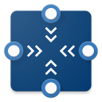
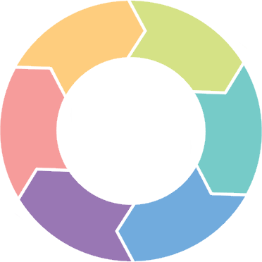
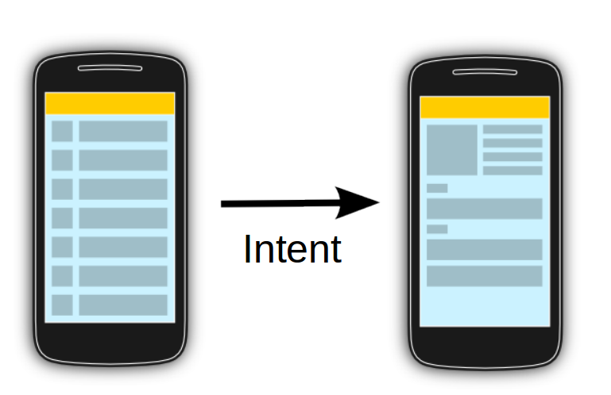

[`Kotlin-Intermedio`](../Readme.md) > `Sesión 2`

## Sesión 2: Activities y Layouts

### 1. Objetivos :dart: 

---

- Diseñar layouts avanzados
- Explorar el flujo de un Activity
- Crear interacción entre Activities

### 2. Contenido :blue_book:

---

 

#### <ins>Layouts: RelativeLayout</ins>

El Relative Layout es un ViewGroup que organiza su contenido de acuerdo a posiciones relativas a su área o a los otros miembros del layout. Para hacer el enlace con otros Views, se requiere que declaren id's, en el layout de abajo, los id tienen el nombre del color que representa cada vista, para identificarlos mejor.

A continuación crearemos la interfaz de nuestro Activity con un nuevo ViewGroup que describe la posición de sus elementos de forma relativa a su anatomía.

- [**`EJEMPLO 1`**](Ejemplo-01/Readme.md)

---

 

#### <ins>Layouts: ConstraintLayout</ins>

ConstraintLayout es un ViewGroup que se introdujo en el SDK de Android en la versión 2.3 de Android Studio, y que logró hacer un gran cambio en la manera como se hacen las vistas. La idea principal de este contenedor es evitar el uso de layouts anidados y así mejorar el performance al pintar vistas complejas.

Un constraint es una relación de un objeto a otro, de una manera restrictiva o de referencia, que nos ayuda a posicionar los elementos en relación o restricción de otros.

- [**`EJEMPLO 2`**](Ejemplo-02/Readme.md)
- [**`EJEMPLO 3`**](Ejemplo-03/Readme.md)

---

 

#### <ins>Activity</ins>

Una Activity en Android se corresponde con una pantalla de nuestra App. En realidad es un punto de entrada que Android puede cargar en cualquier momento. Se compone de:

- Una clase, que normalmente extiende de AppCompatActivity. Es donde definimos el código de lo que queremos que haga la App.
- Un layout, que identifica la apariencia de la vista, el diseño. Tiene formato XML, pero se puede utilizar el diseñador para hacerlo más sencillo
- Una definición de su uso, que se realiza en el AndroidManifest.

A continuación repasaremos el concepto de _Activity_ en Android, su ciclo de vida y las acciones que podemos hacer en cada una de sus etapas.

- [**`EJEMPLO 4`**](Ejemplo-04/Readme.md)

---

 

#### <ins>Comunicación entre Activities</ins>

Una vez comprendido el concepto de Activity, ahora crearemos dos y haremos transmisión de datos entre ellas.

- [**`EJEMPLO 5`**](Ejemplo-05/Readme.md)

---

### 3. Proyecto :hammer:

Con los temas anteriores, haz una transición entre tu formulario y tu pantalla principal empleando _constraint layouts.

- [**`PROYECTO SESIÓN 2`**](Proyecto/Readme.md)

 

[`Anterior`](../Sesion-02/Readme.md) | [`Siguiente`](../Sesion-03/Readme.md)      

