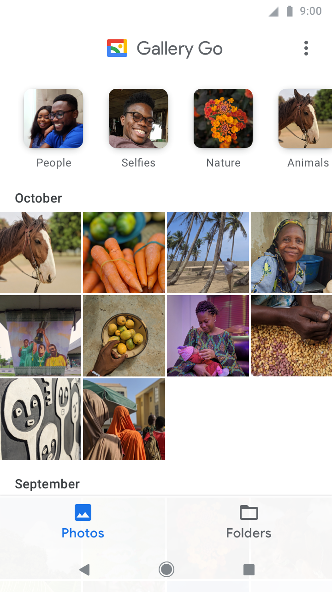

[`Kotlin Intermedio`](../../Readme.md) > [`Sesión 03`](../Readme.md) > `Proyecto`

## Proyecto

### 1. Objetivos :dart:

- Crear una pantalla de items para tu aplicación final, integrando RecyclerView, Layout no lineal, textos e imágenes.

### 2. Requisitos :clipboard:

- Android Studio Instalado en nuestra computadora.

### 3. Desarrollo :computer:

Las listas son elementos esenciales en las aplicaciones. Por ejemplo, en nuestra aplicación de galería, tenemos un grid de fotos que al pulsar sobre un elemento, se despliega la imagen para abarcar toda la pantalla. En una app bancaria, el historial de transacciones se muestran en lista. Para una app de cine, las películas están listadas de forma vertical y así prácticamente para cualquier ejemplo de aplicación, encontraremos una forma de utilizarla.

Ejemplo de la app gallery go, donde tenemos un listado de nuestras imágenes y videos. 

En general, la implementación de una lista en el proyeto es esencial y prácticamente para cualquier ejemplo de aplicación tendremos una forma de utilizarla.

### Lineamientos

1. Genera una nueva pantalla en tu proyecto que contenga una lista de elementos, con un _RecyclerView_.
2. Al pulsar sobre cualquier elemento del _RecyclerView_, deberá permitirse la navegación a una nueva pantalla, donde se puedan ver los detalles del elemento (las acciones a realizar en ella, son libres).
3. Cada elemento deberá tener en su _layout_ al menos dos textos y una imagen.
4. Preferentemente, la distribución del _layout_ no debe ser lineal.

[`Anterior`](../Reto-03/Readme.md) | [`Siguiente`](../../Sesion-04/Readme.md)

