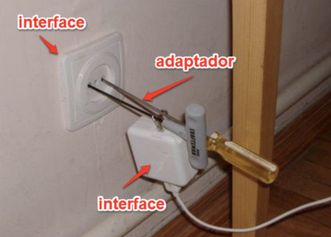
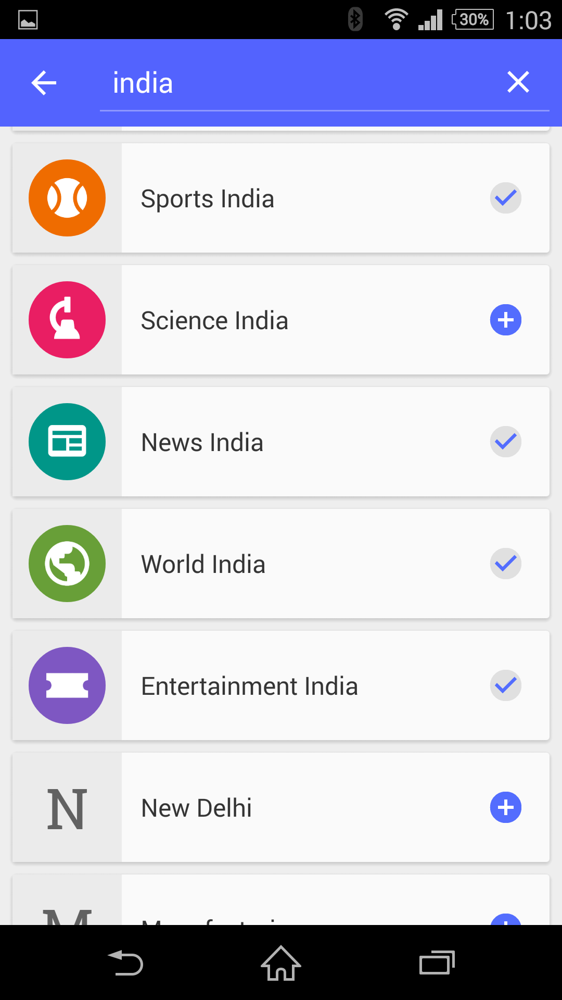
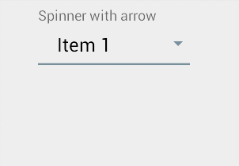
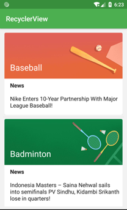

[`Kotlin-Intermedio`](../Readme.md) > `Sesión 3`

## Sesión 3: Listas

### Introducción: Patrón Adapter y Lists

El patrón __Adapter__ es un patrón estructural cuya función principal es comunicar dos interfaces en un principio incompatibles. Como su nombre lo indica,  adapta la información de una interfaz para que pueda ser utilizada por otra. El Adapter actúa como único nodo de adaptación de interfaz para evitar la repetición de código e instanciamiento innecesario.

### 1. Objetivos :dart: 

---

- Ejecutar los pasos para crear listas desplegables
- Experimentar con los elementos de las listas
- Utilizar layouts personalizados para crear diferentes estilos

### 2. Contenido :blue_book:

---

 

#### <ins>ListView</ins>

El ListView es un contenedor de vistas (un ViewGroup) que permite la creación rápida de una lista de elementos en pantalla con un scroll automático que envuelve al ListView.

Se creará una Lista con scrolling vertical simple y lineal, con un Adapter prefabricado a manera de introducción al tema.

- [**`EJEMPLO 1`**](Ejemplo-01/Readme.md)
- [**`EJEMPLO 1-A`**](Ejemplo-01a/Readme.md)

---

 

#### <ins>Spinner</ins>

Veremos ahora un tipo de AdapterView desplegable/contraíble, que nos ofrezca una forma reducida de presentar valores seleccionables en forma de lista.

- [**`EJEMPLO 2`**](Ejemplo-02/Readme.md)
- [**`RETO 1`**](Reto-01/Readme.md)

---

 

#### <ins>RecyclerView</ins>

Esta clase es una mejora de los _ListAdapters_, reciclando _Views_ y métodos para ahorrar recursos. En este ejemplo crearemos uno desde cero, incluyendo su _Adapter._ 

- [**`EJEMPLO 3`**](Ejemplo-03/Readme.md)
- [**`RETO 2`**](Reto-02/Readme.md)

---

### 3. Proyecto :hammer:

Con los temas anteriores, construye una pantalla de items ajustado al concepto de tu proyecto.

- [**`PROYECTO SESIÓN 3`**](Proyecto/Readme.md)

 

[`Anterior`](../Sesion-03/Readme.md) | [`Siguiente`](../Sesion-04/Readme.md)      

