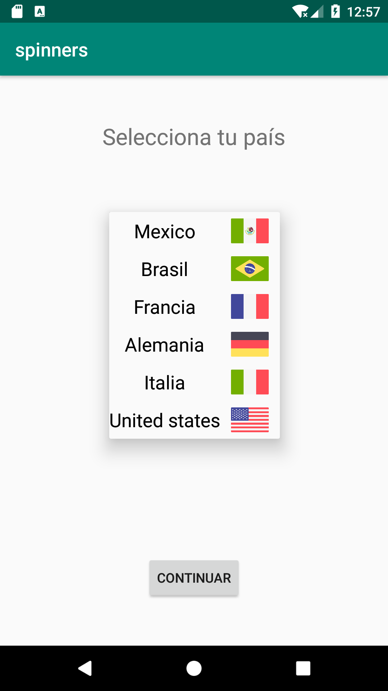

[`Kotlin Intermedio`](../../Readme.md) > [`Sesión 03`](../Readme.md) > `Reto 1`

## Reto 1: Spinners

<div style="text-align: justify;">

### 1. Objetivos :dart:

- Desarrollar vistas y acciones personalizadas en Spinners

### 2. Requisitos :clipboard:

- Android Studio Instalado en nuestra computadora

### 3. Desarrollo :computer:

Ahora comenzarás a aplicar lo aprendido en los ejemplos anteriores.

Para completar este reto realiza lo siguiente:

1. Genera una nueva pantalla con un spinner, al desplegar este spinner se deben mostrar 6 paises con nombre y bandera.
2. Cuando el usuario de clic en alguno de los paises se debe mostrar un diálogo con un saludo en su idioma.

La pantalla final tiene que quedar de la siguiente manera:



<br/>
<details><summary>Solución</summary>
<p>


1. Tomamos todo el código del [Ejemplo 02](../Ejemplo-02) como base del siguiente ejercicio.

2. Pasa los recursos de la carpeta [Resources](Resources/) y agregalos a la carpeta drawable de tu proyecto.

3. La construcción del adapter, del modelo y la lógica en general es casi idéntica a la del [Reto 01](../Reto-01), así que se puede tomar de guía


4. Agregamos las siguientes funciones, que sirven para generar los datos del país y para mostrar un diálogo de alerta.

    ```kotlin
    private fun getCountries(): ArrayList<CountryModel>{
        val countryModels = arrayListOf(
            CountryModel("Mexico",R.drawable.mexico, "Continuar", "Muchas gracias","Selecciona tu país"),
            CountryModel("Brasil",R.drawable.brazil, "Continuar", "Muito obrigado"," Selecione seu país"),
            CountryModel("Francia",R.drawable.france, "Continuez", "Merci beaucoup", "Sélectionnez votre pays"),
            CountryModel("Alemania",R.drawable.germany, "FortFühren", "Danke sehr", "Wählen Sie Ihr Land aus"),
            CountryModel("Italia",R.drawable.italy, "Continuare", "Molto grazie", "Seleziona il tuo paese"),
            CountryModel("United states",R.drawable.united_states, "Next", "Thank you", "Select your country")
        )

        return countryModels
    }

    private fun showDialog(title:String,message:String){
        val builder = AlertDialog.Builder(this)
            .setTitle(title)
            .setMessage(message)
            .setPositiveButton("OK"){_, _->  }

        val alertDialog = builder.create()
            alertDialog.show()
    }
    ```

    también el xml de MainActivity

    ```xml
    <?xml version="1.0" encoding="utf-8"?>
    <androidx.constraintlayout.widget.ConstraintLayout xmlns:android="http://schemas.android.com/apk/res/android"
        xmlns:app="http://schemas.android.com/apk/res-auto"
        xmlns:tools="http://schemas.android.com/tools"
        android:layout_width="match_parent"
        android:layout_height="match_parent"
        tools:context=".MainActivity">

        <Spinner
            android:id="@+id/spinner"
            android:layout_width="180dp"
            android:layout_height="40dp"
            android:layout_marginStart="8dp"
            android:layout_marginTop="64dp"
            android:layout_marginEnd="8dp"
            android:background="#EDEDED"
            app:layout_constraintEnd_toEndOf="parent"
            app:layout_constraintStart_toStartOf="parent"
            app:layout_constraintTop_toBottomOf="@+id/tvTitle" />

        <TextView
            android:id="@+id/tvTitle"
            android:layout_width="wrap_content"
            android:layout_height="wrap_content"
            android:layout_marginTop="48dp"
            android:textSize="24sp"
            android:text="Selecciona tu País"
            app:layout_constraintEnd_toEndOf="parent"
            app:layout_constraintStart_toStartOf="parent"
            app:layout_constraintTop_toTopOf="parent" />

        <Button
            android:id="@+id/button"
            android:layout_width="wrap_content"
            android:layout_height="wrap_content"
            android:visibility="gone"
            android:layout_marginBottom="48dp"
            android:text="Continuar"
            app:layout_constraintBottom_toBottomOf="parent"
            app:layout_constraintEnd_toEndOf="parent"
            app:layout_constraintStart_toStartOf="parent" />

    </androidx.constraintlayout.widget.ConstraintLayout>
    ```

</p>
</details>
<br/>


[`Anterior`](../Ejemplo-02/Readme.md) | [`Siguiente`](../Ejemplo-03/Readme.md)


</div>
