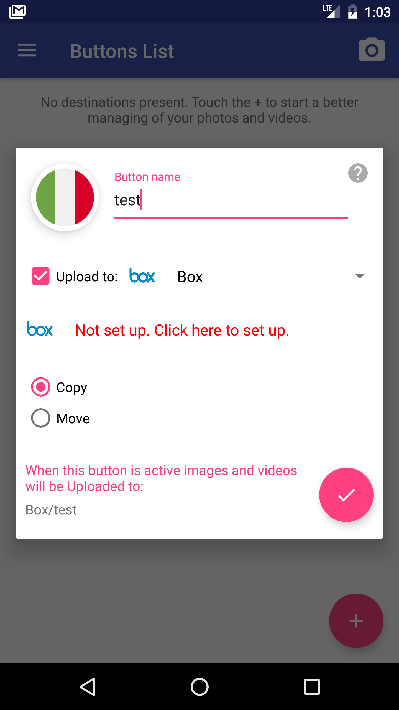

[`Kotlin Intermedio`](../../Readme.md) > [`Sesión 04`](../Readme.md) > `Proyecto`

## Proyecto: Fragments

### 1. Objetivos :dart:

- Modularizar el proyecto mediante ___Fragments___.
- Implementar _fragments_ para lograr una app flexible para diversos dispositivos, o crear un flujo.

### 2. Requisitos :clipboard:

- Android Studio Instalado en nuestra computadora.

### 3. Desarrollo :computer:

#### Definir el uso del fragment

A continuación veremos ciertas ideas que nos ayudarán a aterrizar nuestro proyecto.

Para conseguir implementar _fragments_ de manera natural en nuestro proyecto, buscaremos la forma de cómo encajarla.

- Si es una app que implique la compra de un producto, podemos hacer un flujo de _fragments_ que impliquen la selección del producto, después el ingreso de la dirección de envío, y por último la captura del método de pago.

- Si es una app tipo spotify, podemos crear una interfaz donde se muestre un patrón lista-detalle para seleccionar música y en el detalle los datos de la canción (esto aplica también para apps como imdb, etc.)

- Un clon de una app de entregas a domicilio podría implementar un flujo.

- Al abrir un video en youtube, se puede ver cómo salta un _fragment_ emergente donde se reproduce el video. Podemos hacer una simulación básica de ese comportamiento.

#### Tips

El uso del ___DialogFrament___ es permitido en este módulo, en [Este artículo](https://guides.codepath.com/android/using-dialogfragment) se explica un poco más de cómo implementarlo (el lenguaje es Java, pero es bastante comprensible).

#### Lineamientos

1. Implementa al menos dos _fragments_ en el proyecto.
2. Cualquier forma de implementación de _fragments_ es válido.
3. El uso de los _fragments_ debe ser adecuado (no utilizarlos en lugares donde no se requieran).

#### Checklist

- [ ] Pantalla iniciar sesión
- [ ] Pantalla crear cuenta
- [ ] Pantalla que utilice ConstraintLayout con al menos 3 views
- [ ] Pantalla que incluya RecyclerView con una lista de elementos, donde se pueda dar clic a los elementos y ver más información
- [ ] Por lo menos dos fragments

[`Anterior`](../Ejemplo-03/Readme.md) | [`Siguiente`](../../Sesion-05/Readme.md)

