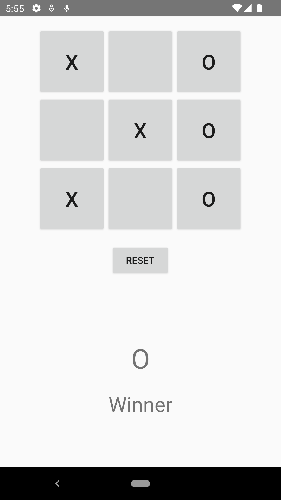

[`Kotlin Avanzado`](../../Readme.md) > [`Sesión 05`](../Readme.md) > `Ejemplo 1`

## Ejemplo 1: MVC

<div style="text-align: justify;">


### 1. Objetivos :dart:

- Comprender el funcionamiento del patrón MVC (Modelo Vista Controlador)

### 2. Requisitos :clipboard:

- Android Studio Instalado en nuestra computadora.

### 3. Desarrollo :computer:

1. Abre Android Studio y crea un nuevo proyecto con Activity Vacía (Empty Activity).

2. En el directorio layout crearemos un nuevo archivo xml para nuestro Acvity. Este layout representa la interfaz "View".

    ```xml
    <?xml version="1.0" encoding="utf-8"?>
    <LinearLayout xmlns:android="http://schemas.android.com/apk/res/android"
        xmlns:tools="http://schemas.android.com/tools"
        android:id="@+id/tictactoe"
        android:layout_width="match_parent"
        android:layout_height="match_parent"
        android:gravity="center_horizontal"
        android:orientation="vertical"
        android:padding="16dp"
        tools:context=".controller.MainActivity">

        <GridLayout
            android:id="@+id/buttonGrid"
            android:layout_width="wrap_content"
            android:layout_height="wrap_content"
            android:columnCount="3"
            android:rowCount="3">

            <Button
                style="@style/tictactoebutton"
                android:onClick="onCellClicked"
                android:tag="00" />

            <Button
                style="@style/tictactoebutton"
                android:onClick="onCellClicked"
                android:tag="01" />

            <Button
                style="@style/tictactoebutton"
                android:onClick="onCellClicked"
                android:tag="02" />

            <Button
                style="@style/tictactoebutton"
                android:onClick="onCellClicked"
                android:tag="10" />

            <Button
                style="@style/tictactoebutton"
                android:onClick="onCellClicked"
                android:tag="11" />

            <Button
                style="@style/tictactoebutton"
                android:onClick="onCellClicked"
                android:tag="12" />

            <Button
                style="@style/tictactoebutton"
                android:onClick="onCellClicked"
                android:tag="20" />

            <Button
                style="@style/tictactoebutton"
                android:onClick="onCellClicked"
                android:tag="21" />

            <Button
                style="@style/tictactoebutton"
                android:onClick="onCellClicked"
                android:tag="22" />

        </GridLayout>

        <Button
            android:layout_width="wrap_content"
            android:layout_height="wrap_content"
            android:layout_margin="16dp"
            android:onClick="onClickReset"
            android:text="@string/reset" />

        <LinearLayout
            android:id="@+id/winnerPlayerViewGroup"
            android:layout_width="wrap_content"
            android:layout_height="match_parent"
            android:gravity="center"
            android:orientation="vertical"
            android:visibility="gone"
            tools:visibility="visible">

            <TextView
                android:id="@+id/winnerPlayerLabel"
                android:layout_width="wrap_content"
                android:layout_height="wrap_content"
                android:layout_margin="20dp"
                android:textSize="40sp"
                tools:text="X" />

            <TextView
                android:layout_width="wrap_content"
                android:layout_height="wrap_content"
                android:text="@string/winner"
                android:textSize="30sp" />

        </LinearLayout>

    </LinearLayout>
    ```

    La vista queda la siguiente manera:

    

3. Ahora generamos dos package **model** y **controller** uno para los modelos y el otro para los controladores.

4. Dentro del package **model** generamos las siguientes clases

    ```java
    enum class Player {
        X,
        O
    }
    ```

    ```java
    class Cell {
        var value: Player? = null
    }
    ```

    ```java
    class Board {
        private val cells = Array(3) {
            arrayOfNulls<Cell>(
                3
            )
        }
        var winner: Player? = null
            private set
        private var state: GameState? = null
        private var currentTurn: Player? = null

        private enum class GameState {
            IN_PROGRESS,
            FINISHED
        }

        init {
            restart()
        }

        fun restart() {
            clearCells()
            winner = null
            currentTurn = Player.X
            state = GameState.IN_PROGRESS
        }

        fun mark(row: Int, col: Int): Player? {
            var playerThatMoved: Player? = null
            if (isValid(row, col)) {
                cells[row][col]!!.value = currentTurn
                playerThatMoved = currentTurn
                if (isWinningMoveByPlayer(currentTurn, row, col)) {
                    state = GameState.FINISHED
                    winner = currentTurn
                } else {
                    flipCurrentTurn()
                }
            }
            return playerThatMoved
        }

        private fun clearCells() {
            for (i in 0..2) {
                for (j in 0..2) {
                    cells[i][j] = Cell()
                }
            }
        }

        private fun isValid(row: Int, col: Int): Boolean {
            return if (state == GameState.FINISHED) {
                false
            } else if (isOutOfBounds(row) || isOutOfBounds(col)) {
                false
            } else if (isCellValueAlreadySet(row, col)) {
                false
            } else {
                true
            }
        }

        private fun isOutOfBounds(idx: Int): Boolean {
            return idx < 0 || idx > 2
        }

        private fun isCellValueAlreadySet(row: Int, col: Int): Boolean {
            return cells[row][col]!!.value != null
        }

        private fun isWinningMoveByPlayer(player: Player?, currentRow: Int, currentCol: Int): Boolean {
            return cells[currentRow][0]!!.value == player && cells[currentRow][1]!!.value == player && cells[currentRow][2]!!.value == player || cells[0][currentCol]!!.value == player && cells[1][currentCol]!!.value == player && cells[2][currentCol]!!.value == player || currentRow == currentCol && cells[0][0]!!.value == player && cells[1][1]!!.value == player && cells[2][2]!!.value == player || currentRow + currentCol == 2 && cells[0][2]!!.value == player && cells[1][1]!!.value == player && cells[2][0]!!.value == player
        }

        private fun flipCurrentTurn() {
            currentTurn = if (currentTurn == Player.X) Player.O else Player.X
        }
    }
    ```

5. Una vez generados los modelos movemos el MainActivity al package de controllers y modificamos el código como se muestra.

    ```java
    import android.os.Bundle
    import android.util.Log
    import android.view.View
    import android.view.ViewGroup
    import android.widget.Button
    import android.widget.TextView
    import androidx.activity.ComponentActivity
    import com.bedu.myapplication.R
    import com.bedu.myapplication.model.Board

    class MainActivity : ComponentActivity() {
        private var model: Board? = null
        private var buttonGrid: ViewGroup? = null
        private var winnerPlayerViewGroup: View? = null
        private var winnerPlayerLabel: TextView? = null

        override fun onCreate(savedInstanceState: Bundle?) {
            super.onCreate(savedInstanceState)
            setContentView(R.layout.activity_main)
            winnerPlayerLabel = findViewById(R.id.winnerPlayerLabel)
            winnerPlayerViewGroup = findViewById(R.id.winnerPlayerViewGroup)
            buttonGrid = findViewById(R.id.buttonGrid)
            model = Board()
        }

        fun onCellClicked(v: View) {
            val button = v as Button
            val tag = button.tag.toString()
            val row = tag.substring(0, 1).toInt()
            val col = tag.substring(1, 2).toInt()
            Log.i(TAG, "Click Row: [$row,$col]")
            val playerThatMoved = model!!.mark(row, col)
            if (playerThatMoved != null) {
                button.text = playerThatMoved.toString()
                if (model!!.winner != null) {
                    winnerPlayerLabel!!.text = playerThatMoved.toString()
                    winnerPlayerViewGroup!!.visibility = View.VISIBLE
                }
            }
        }

        fun onClickReset(v: View) {
            winnerPlayerViewGroup!!.visibility = View.GONE
            winnerPlayerLabel!!.text = ""
            model!!.restart()
            for (i in 0 until buttonGrid!!.childCount) {
                (buttonGrid!!.getChildAt(i) as Button).text = ""
            }
        }

        companion object {
            private val TAG = MainActivity::class.java.name
        }
    }
    ```

6. Ejecuta la app en tu dispositivo, debe verse como se muestra a continuación


    


[`Anterior`](../Readme.md) | [`Siguiente`](../Ejemplo-02/Readme.md)

</div>

