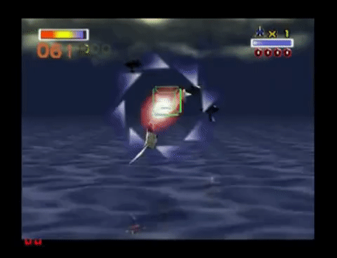
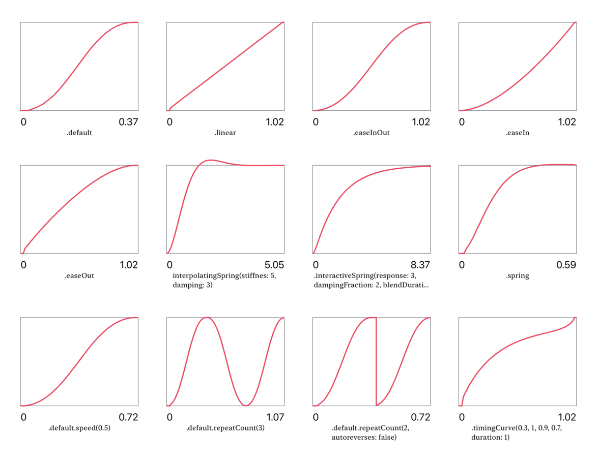
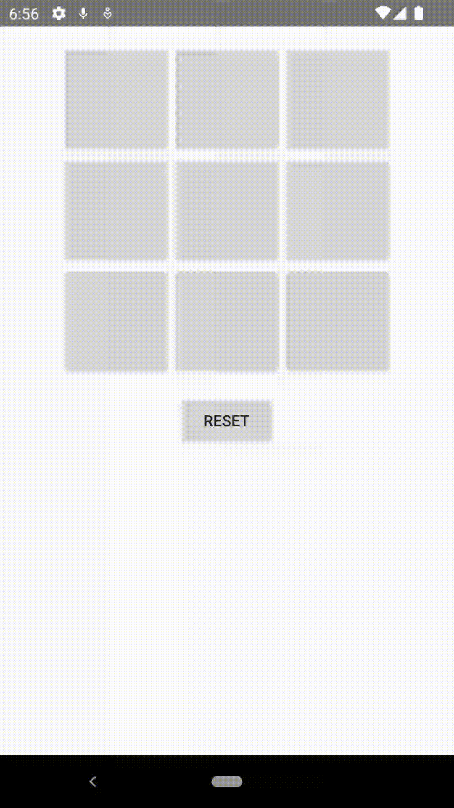

[`Kotlin Avanzado`](../../Readme.md) > [`Sesión 05`](../Readme.md) > `Ejemplo 2`

## Ejemplo 2: Animators

<div style="text-align: justify;">


### 1. Objetivos :dart:

- Comprender el funcionamiento esencial de las animaciones en Android
- Aplicar conocimientos para generar nuestras propias animaciones

### 2. Requisitos :clipboard:

- Android Studio Instalado en nuestra computadora.

### 3. Desarrollo :computer:

El siguiente ejemplo consiste en realizar una serie de animaciones a partir de que el jugador da clic.

Para realizarlo primero debemos conocer algunos conceptos, los cuales se muestran a continuación.

- Property Animations

    Las propiedades son:

    * ___translationX___ y ___translationY___: Mueve un ___View___ desde una posición inicial hsta una final, con respecto al sistema de coordenadas.
    * ___rotation___, ___rotationX___ y ___rotationY___: controla la rotación, mientras que rotationX y rotationY controlan la rotación en un espacio tridimensional.
    * ___scaleX___ y ___scaleY___: La escala con respecto a una dimensión (para x es el ancho, para y es el largo).
    * ___pivotX___ y ___pivotY___: El pivote es un punto en el ___View___ de referencia para aplicar la tranformación de escalamiento y rotación, y por defecto está situado en su centro. Con estas propiedades podemos redefinir la posición del pivote.
    * ___x___ y ___y___: Controla la posición del ___View___ con respecto a su container.
    * ___alpha___: Determina la transparencia del ___View___, donde 0 es totalmente transparente y 1 es totalmente opaco.

- Value Animators

    La clase ___ValueAnimator___ es una extensión 100% utilizable de la clase ___Animation___. Ésta calcula los valores de la propiedad animada, y comunica las actualizaciones de dicho valor a través de un listener, donde podremos actualizar la propiedad de nuestro objeto a animar y realizar acciones extras.  

    Vamos a animar un barrel roll (giro) mediante ___rotation___.

    

- Interpoladores

    Una interpolación es el proceso de obtener puntos dentro de un rango de valores, a partir de otros puntos. Los _Interpolator_ son clases que interpolan valores con respecto del tiempo, a partir de un rango de valores. . Los interpoladores nos permitirán determinar el movimiento de una animación.

    

    _Imagen. Ejemplos de curvas de animación con valores interpolados._

- ObjectAnimator

    Un ___ObjectAnimator___ es una clase que hereda de ___ValueAnimator___ y a diferencia de este último, solo requerimos pasar como parámetro el nombre de la propiedad a animar, sin requerir un listener. Esta clase se ocupa la mayor parte del tiempo, a menos que querramos realizar acciones personalizadas al actualizarse un valor de animación.

---

<br/>

1. Abre el proyecto del ejemplo pasado

2. Genera un método ___barrelRoll___ y ahí agregamos lo necesario. Creamos un ___ValueAnimator___ de valor flotante que rote dos veces, es decir 720°. 

    ```java
    val valueAnimator = ValueAnimator.ofFloat(0f, 720f)
    ```

    A este objeto le agregamos un listener que va a activarse cuando el flotante se actualice, aquí actualizaremos nuestra propiedad de rotación de nuestro ___View___. 

    ```java
    valueAnimator.addUpdateListener {
        val value = it.animatedValue as Float
        v.rotationY = value
    }
    ```

3. Ahora, configuramos la duración de la animación y la reproducimos. 

    ```java
    valueAnimator.interpolator = AccelerateDecelerateInterpolator()
    valueAnimator.duration = 1000
    valueAnimator.start()
    ```

    El método queda así:

    ```java
    private fun barrelRoll(v: View) {
        val valueAnimator = ValueAnimator.ofFloat(0f, 720f)

        valueAnimator.addUpdateListener {
            val value = it.animatedValue as Float
            v.rotationY = value
        }

        valueAnimator.interpolator = AccelerateDecelerateInterpolator()
        valueAnimator.duration = 1000
        valueAnimator.start()
    }
    ```

4. Jugamos ahora con las otras rotaciones  (___rotation___ y ___rotationX___ ) para ver cómo giran en torno a los 3 ejes.

5. Ahora, animaremos movimiento a través de un archivo xml.

    La clase AnimatorSet sirve para ordenar y reproducir un bloque de animaciones de acuerdo al orden. Podemos declararlos como recurso o de forma programática.

    Creamos un directorio para almacenar nuestros animators, en ***res*** > ***new*** > ***android resource directory*** . En **Resource type** seleccionar ___animator___ y seleccionar OK.

    Ahí creamos nuestro recurso, donde describimos nuestro animator. click derecho en ___animator___ > ___new___ > ***Animator Resource File***.

    ```xml
    <?xml version="1.0" encoding="utf-8"?>
    <set
        xmlns:android="http://schemas.android.com/apk/res/android"
        android:ordering="sequentially">
        <set
            android:ordering="together">
            <objectAnimator
                android:propertyName="scaleX"
                android:valueTo="0.6"
                android:valueType="floatType"
                android:interpolator="@android:anim/decelerate_interpolator"
                android:duration="600"
                />
            <objectAnimator
                android:propertyName="scaleY"
                android:valueTo="0.6"
                android:valueType="floatType"
                android:interpolator="@android:anim/decelerate_interpolator"
                android:duration="600"
                />
        </set>
        <set>
            <objectAnimator
                android:propertyName="scaleX"
                android:valueTo="1"
                android:interpolator="@android:anim/accelerate_interpolator"
                android:valueType="floatType"
                android:duration="600"
                android:startOffset="2000"
                />
            <objectAnimator
                android:propertyName="scaleY"
                android:valueTo="1"
                android:interpolator="@android:anim/accelerate_interpolator"
                android:valueType="floatType"
                android:duration="600"
                android:startOffset="2000"
            />
        </set>
    </set>
    ```

6. Regresamos al MainActivity y creamos el siguiente método para luego invocarlo cuando el usuario seleccione una opción.

    ```java
    private fun shrinkArwing(v: View) {
        AnimatorInflater.loadAnimator(this, R.animator.shrink).apply {
            setTarget(v)
            start()
        }
    }
    ```

7. Ya para terminar vamos al método onCellClicked y según el turno del jugador aplicaremos la animación a la opción seleccionada.

    ```kotlin
    fun onCellClicked(v: View) {
        val button = v as Button
        val tag = button.tag.toString()
        val row = tag.substring(0, 1).toInt()
        val col = tag.substring(1, 2).toInt()
        Log.i(TAG, "Click Row: [$row,$col]")
        val playerThatMoved = model!!.mark(row, col)
        if (playerThatMoved != null) {
            button.text = playerThatMoved.toString()
            if (model!!.winner != null) {
                winnerPlayerLabel!!.text = playerThatMoved.toString()
                winnerPlayerViewGroup!!.visibility = View.VISIBLE
            } else {
                if (playerThatMoved == Player.X) {
                    shrinkArwing(v)
                } else {
                    barrelRoll(v)
                }
            }
        }
    }
    ```

 8. Ejecutamos la app y hacemos pruebas para ver las dos animaciones.

    


[`Anterior`](../Ejemplo-01/Readme.md) | [`Siguiente`](../Reto-01/Readme.md)

</div>

