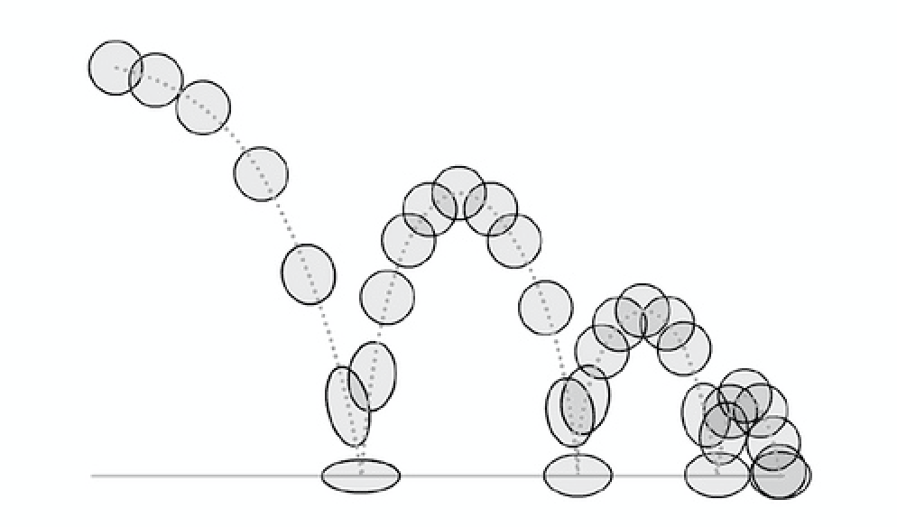

[`Kotlin-Avanzado`](../Readme.md) > `Sesión 5`

## Sesión 5: MVC, animaciones y transiciones

### 1. Objetivos :dart: 

- Construir ejemplo con el patrón *MVC* (Modelo Vista Controlador)
- Indicar al usuario el estado de la aplicación mediante animaciones
- Crear trancisiones entre pantallas de forma orgánica

### 2. Contenido :blue_book:

#### <ins>MCV</ins>

El enfoque model, view, controller separa nuestra aplicación, a nivel general, en un conjunto de 3 responsabilidades.

1. Modelo "Model"

    El modelo se constituye por los datos, el estado y la lógica de negocio.

    No está vinculado a la vista ni al controlador, y gracias a esto, es reutilizable en muchos contextos.

2. Vista "View"

    La vista es la representación del modelo.

    La vista tiene la responsabilidad de presentar la interfaz de usuario (UI) y comunicarse con el controlador a medida que el usuario interactúa con la aplicación.

    En la arquitectura MVC, se dice que las vistas son generalmente "tontas" ya que no tienen conocimiento del modelo. No comprenden el estado o qué hacer cuando un usuario interactúa (haciendo clic en un botón, escribiendo un valor, etc).

    Cuanto menos sepan las vistas, menos acopladas estarán (respecto al modelo y controlador), y por lo tanto, serán más flexibles ante cambios.

3. Controlador "Controller"

    El controlador es el pegamento que une la aplicación.

    Los controladores determinan lo que sucede en la aplicación.

    Cuando la Vista le dice al controlador que un usuario hizo clic en un botón, el controlador decide cómo interactuar con el modelo correspondiente.

    Según el cambio de datos en el modelo, el controlador decide si actualizar el estado de la vista o no, según considere apropiado.

    En el caso de una aplicación Android, el controlador casi siempre está representado por una Activity o un Fragment.

- [**`EJEMPLO 1`**](Ejemplo-01/Readme.md)

---

#### <ins>Animators</ins>

Mediante el uso de la clase ___Animator___ y quienes heredan de esta, realizaremos varias animaciones a nuestros views con respecto a movimiento, dimensiones, rotación y transparencia.

- [**`EJEMPLO 2`**](Ejemplo-02/Readme.md)
- [**`RETO 1`**](Reto-01/Readme.md)

---

#### <ins>Transitions</ins>

Haremos uso de Transitions para crear animaciones suaves en el flujo de navegación y entre nuestros Views.

- [**`EJEMPLO 3`**](Ejemplo-03/Readme.md)
- [**`RETO 2`**](Reto-02/Readme.md)

 

---

### 3. Proyecto :hammer:

Aplica los lineamientos que vienen en esta guía para agregar algunas animaciones y transiciones a la aplicación.

- [**`PROYECTO SESIÓN 5`**](Proyecto/Readme.md)

 

[`Anterior`](../Sesion-04/Readme.md) | [`Siguiente`](../Sesion-06/Readme.md)      

