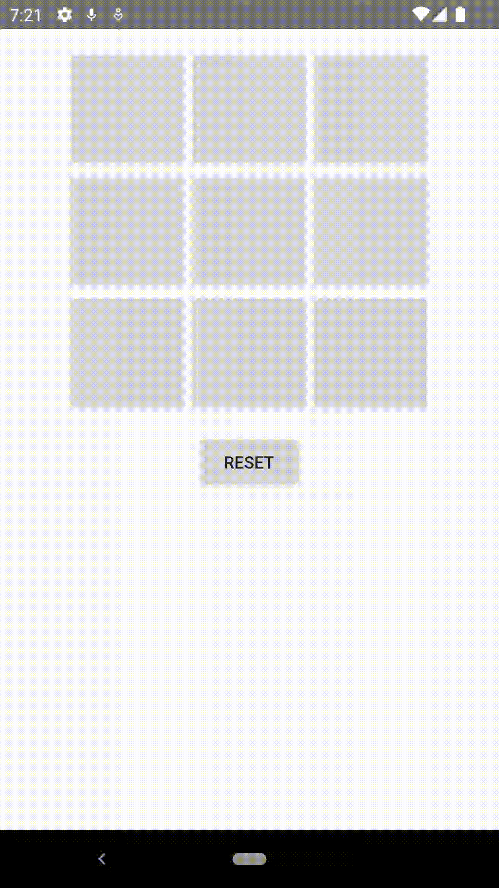

[`Kotlin Avanzado`](../../Readme.md) > [`Sesión 05`](../Readme.md) > `Reto 1`

## Reto 1: Animators

<div style="text-align: justify;">


### 1. Objetivos :dart:

- Crear una animación utilizando cualquiera de las propiedades revisadas

### 2. Requisitos :clipboard:

- Android Studio Instalado en nuestra computadora.

### 3. Desarrollo :computer:

Ahora toca poner en práctica lo visto hasta ahora.

Para completar este reto aplica una animación a la sección del ganador del juego, **está animación debe ser diferente a la vista en ejemplo 02.**

A continuación te mostramos como podría quedar



<details>
	<summary>Solucion</summary>

1. Generamos la animación

    ```xml
    <?xml version="1.0" encoding="utf-8"?>
    <set
        xmlns:android="http://schemas.android.com/apk/res/android"
        android:ordering="together">
        <objectAnimator
            android:propertyName="translationX"
            android:valueTo="200"
            android:valueType="floatType"
            android:interpolator="@android:anim/cycle_interpolator"
            android:duration="3000"
            />
        <objectAnimator
            android:propertyName="translationY"
            android:valueTo="-300"
            android:interpolator="@android:anim/decelerate_interpolator"
            android:valueType="floatType"
            android:duration="3000"
            />

    </set>
    ```

2. Creamos el método que invoque la nueva animación

    ```java
    private fun shrinkDodging(v: View) {
        AnimatorInflater.loadAnimator(this, R.animator.dodging).apply {
            setTarget(v)
            start()
        }
    }
    ```

3. Por ultimo dentro del método onCellClicked, donde se cambia la visibilidad de la vista del ganador mandamos llamar el método shrinkDodging

    ```java
    winnerPlayerLabel!!.text = playerThatMoved.toString()
    winnerPlayerViewGroup!!.visibility = View.VISIBLE
    shrinkDodging(winnerPlayerViewGroup!!)
    ```

</details>

 
<br/>


[`Anterior`](../Ejemplo-02/Readme.md) | [`Siguiente`](../Ejemplo-03/Readme.md)

</div>

