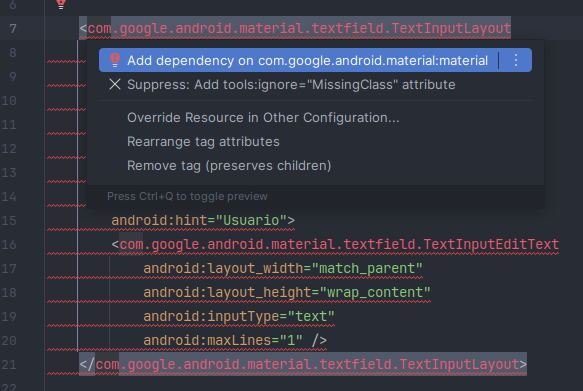
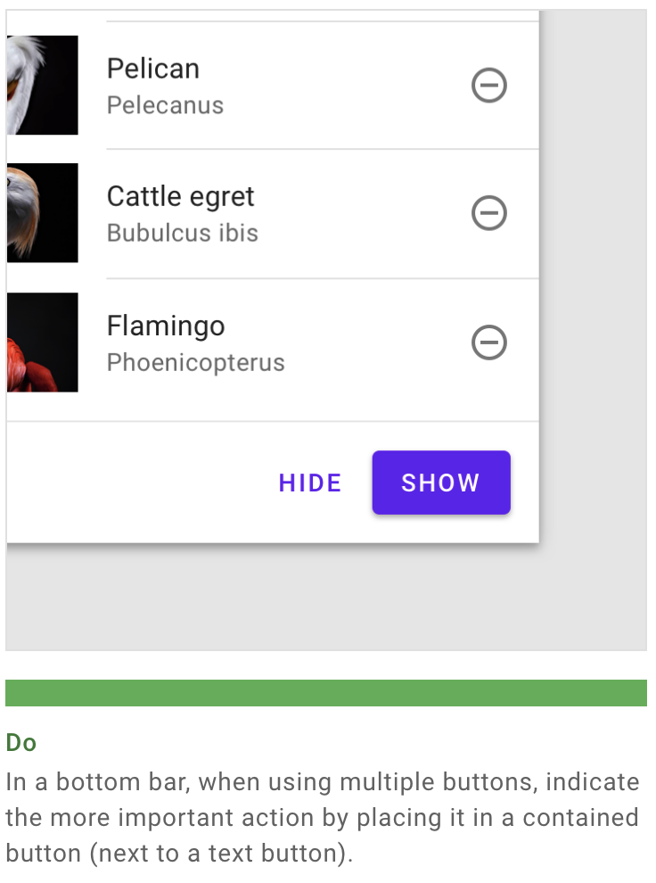
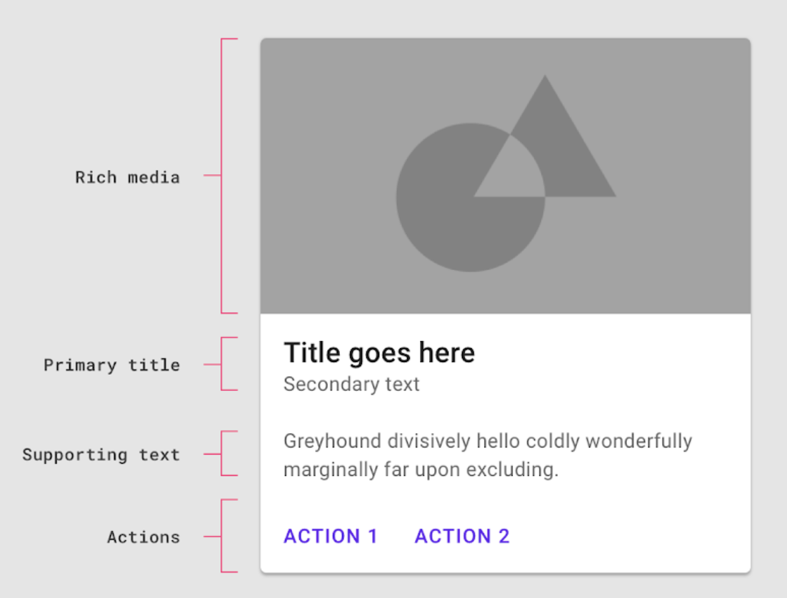
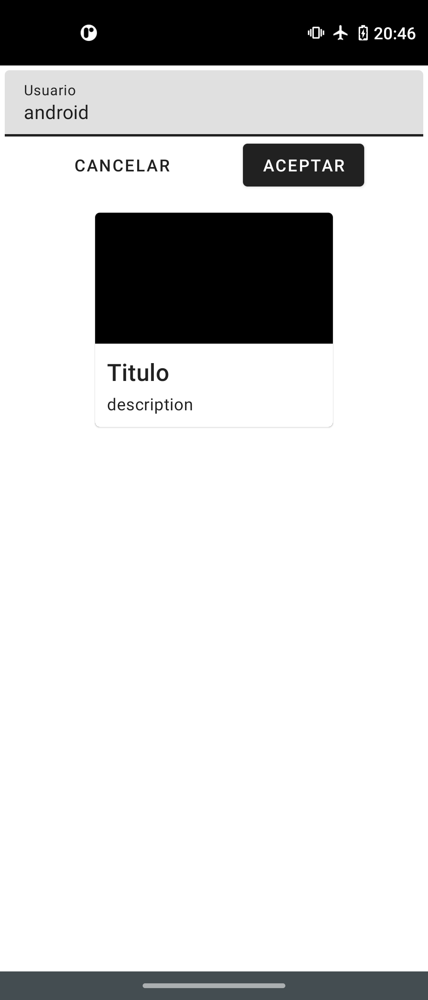

[`Kotlin Intermedio`](../../Readme.md) > [`Sesión 06`](../Readme.md) > `Ejemplo 1`

## Ejemplo 1: Components

<div style="text-align: justify;">

### 1. Objetivos :dart:

- Implementar _Components_ de Material Design en nuestra interfaz.

### 2. Requisitos :clipboard:

1. Android Studio Instalado en nuestra computadora.
2. Seguir las instrucciones para esta sesión.

### 3. Desarrollo :computer:

La meta de este ejemplo: Agregar algunos de los components básicos a nuestro _layout_ y asignarles funcionalidad.

1. Abre __Android Studio__ y crea un nuevo proyecto con Activity Vacía (Empty Activity) con "Groovy DSL".

2. Generamos el ___activity_main.xml___, donde colocamos algunos de los componentes que nos provee la librería de material. Recordemos antes de existir la librería ___com.google.android.material___,  utilizábamos ___com.android.support:design____.

    Ahora, vamos a utilizar el primer _component_: ___TextInputLayout___.

    ```xml
    <com.google.android.material.textfield.TextInputLayout
        android:id="@+id/editNormal"
        android:layout_width="0dp"
        android:layout_height="wrap_content"
        android:layout_margin="4dp"
        android:hint="Usuario"
        app:layout_constraintEnd_toEndOf="parent"
        app:layout_constraintStart_toStartOf="parent"
        app:layout_constraintTop_toTopOf="parent">

        <com.google.android.material.textfield.TextInputEditText
            android:layout_width="match_parent"
            android:layout_height="wrap_content"
            android:inputType="text"
            android:maxLines="1" />
    </com.google.android.material.textfield.TextInputLayout>
    ```

    Este componente es un _wrapper_ que contiene un EditText, y provee de un _label_ el la parte superior igual al hint del _EditText_ cuando el usuario ingresa un texto. El _EditText_ que utilizamos es un ___TextInputEditText___, también perteneciente a la librería de material design.

    Podemos agregar un _EditText_ simple para resaltar la diferencia entre estods dos.

3. El xml anterior presentó error, ya que no hemos importado la librería, para agregarla damos clic en el error y luego en **Add dependency on com.google.android.material:material**

    

4. El siguiente elemento a probar, es el ___MaterialButton___, que viene preconfigurado con el estilo _Material_ por defecto, sin requerir configurar la propiedad _style_.

    

    Según Material Design, el botón con mayor importancia es un _contained button_, y la de menor importancia es un _text button_, por lo que vamos a replicar ese patrón:

    ```xml
    <com.google.android.material.button.MaterialButton
        android:id="@+id/cancel_button"
        style="@style/Widget.MaterialComponents.Button.TextButton"
        android:layout_width="wrap_content"
        android:layout_height="wrap_content"
        android:text="Cancelar"
        app:layout_constraintEnd_toStartOf="@id/next_button"
        app:layout_constraintStart_toStartOf="parent"
        app:layout_constraintTop_toBottomOf="@id/editNormal" />

    <com.google.android.material.button.MaterialButton
        android:id="@+id/next_button"
        android:layout_width="wrap_content"
        android:layout_height="wrap_content"
        android:text="Aceptar"
        app:layout_constraintEnd_toEndOf="parent"
        app:layout_constraintStart_toEndOf="@id/cancel_button"
        app:layout_constraintTop_toBottomOf="@id/editNormal" />
    ```

    Como podemos observar, al _text button_ se le agrega un estilo de Material Components, mientras que el _contained_, utiliza el estilo por defecto.

    Para corroborar que tanto las propiedades de estos _Buttons_ como sus métodos funcionan como cualquier _Button_, utilizaremos su _listener_: 

    declaramos las variables:

    ```kotlin
    private lateinit var nextButton: MaterialButton
    private lateinit var cancelButton: MaterialButton
    ```

    Relacionamos las variables al _View_:

    ```kotlin
    nextButton = findViewById(R.id.next_button)
    cancelButton = findViewById(R.id.cancel_button)
    ```

    Y asignamos su respectivo click listener:

    ```kotlin
    nextButton.setOnClickListener{
    Toast.makeText(this,getString(R.string.accept),Toast.LENGTH_SHORT).show()
    }

    cancelButton.setOnClickListener{
    Toast.makeText(this,getString(R.string.cancel),Toast.LENGTH_SHORT).show()
    }
    ```

6. La librería contiene muchos otros componentes listos para utilizarse, implementamos otros dos: 

    ```xml
    <com.google.android.material.slider.Slider
        android:id="@+id/slider"
        android:layout_width="wrap_content"
        android:layout_height="wrap_content"
        android:text="Aceptar"
        app:layout_constraintEnd_toEndOf="parent"
        app:layout_constraintHorizontal_bias="1.0"
        app:layout_constraintStart_toStartOf="parent"
        app:layout_constraintTop_toBottomOf="@+id/next_button" />
    <com.google.android.material.checkbox.MaterialCheckBox
        android:id="@+id/checkbox"
        android:layout_width="wrap_content"
        android:layout_height="wrap_content"
        android:text="Aceptar"
        app:layout_constraintEnd_toEndOf="parent"
        app:layout_constraintStart_toStartOf="parent"
        app:layout_constraintTop_toBottomOf="@+id/slider" />
    ```

    Los cuales son un Slider y un Checkbox.

7. Por último, exploramos un componente bastante característico en _material design_: El CardView. De acuerdo al sitio oficial:

    > Cards contain content and actions about a single subject.

    Estos elementos pueden ser una representación gráfica de un objeto o una lista de objetos, como productos, ciudades, contactos, etc. y dentro de ellas se pueden detonar acciones mediante botones.

    

    Agregamos un ___CardView___ sencillo, con un header superior con color _PrimaryDark_ que simule un archivo media en la parte superior, como lo sugiere la imagen anterior. Agregamos un título y un subtítulo, contenidos por un _LinearLayout_ horizontal.

    ```xml
    <com.google.android.material.card.MaterialCardView
        android:layout_width="200dp"
        android:layout_height="180dp"
        android:layout_marginTop="16dp"
        app:cardBackgroundColor="?attr/colorPrimaryDark"
        app:cardCornerRadius="4dp"
        app:layout_constraintEnd_toEndOf="parent"
        app:layout_constraintStart_toStartOf="parent"
        app:layout_constraintTop_toBottomOf="@id/next_button">

        <LinearLayout
            android:layout_width="match_parent"
            android:layout_height="wrap_content"
            android:layout_gravity="bottom"
            android:background="#FFFFFF"
            android:orientation="vertical"
            android:padding="8dp">

            <TextView
                android:layout_width="match_parent"
                android:layout_height="wrap_content"
                android:padding="2dp"
                android:text="Titulo"
                android:textAppearance="?attr/textAppearanceHeadline6" />

            <TextView
                android:layout_width="match_parent"
                android:layout_height="wrap_content"
                android:padding="2dp"
                android:text="description"
                android:textAppearance="?attr/textAppearanceBody2" />
        </LinearLayout>
    </com.google.android.material.card.MaterialCardView>
    ```

8. Prueba la app en tu dispositivo

    


[`Anterior`](../Readme.md) | [`Siguiente`](../Reto-01/Readme.md)


</div>
