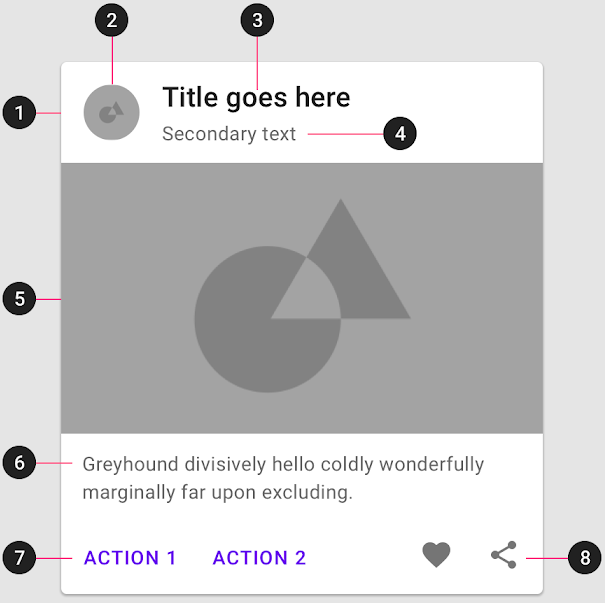
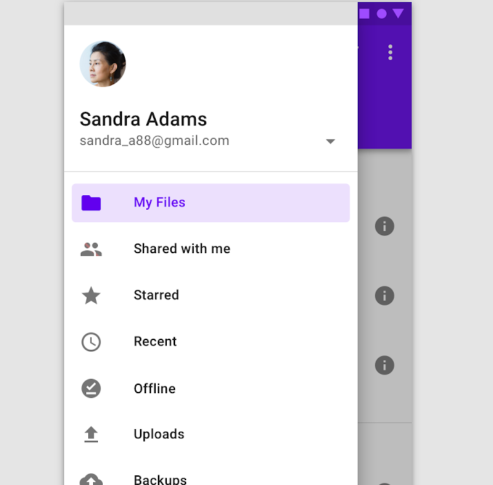
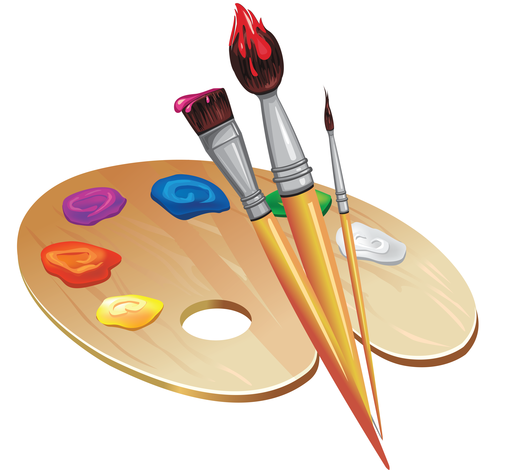

[`Kotlin-Intermedio`](../Readme.md) > `Sesión 6`

## Sesión 6: Material Design

  
  
  
### Introducción

[Material Design](https://m3.material.io/) es un sistema que envuelve a una guía de estilo de diseño, herramientas y componentes para aplicaciones móviles y web. La base del concepto es que toda la interfaz debe ser representada por materiales, (específicamente papel y tinta) y añade conceptos visuales como textura, representación de luces y sombras o altura.

### 1. Objetivos :dart: 

---

- Implementar la guía de estilos de Material Design para asegurar coherencia visual y funcional en el diseño de interfaces.
- Utilizar efectivamente los componentes de la librería _com.google.android.material_ que sigan las directrices de Material Design.
- Renovar interfaces utilizando el modelo de Material Design.

### 2. Contenido :blue_book:

---

 

#### <ins>Components</ins>

Un component es un _View_ apegado a los estándares y usos de _Material Design_. La librería _com.google.android.material_ nos provee de clases que pueden reemplazar las _Views_ que hemos utilizado anteriormente (_Buttons_, _ImageViews_, _EditText_, etc.), o que agregan nuevas funcionalidades. Utilizaremos los elementos más básicos.

- [**`EJEMPLO 1`**](Ejemplo-01/Readme.md)
- [**`RETO 1`**](Reto-01/Readme.md)

---

 

#### <ins>Appbar y Navigation drawer</ins>

Crearemos y personalizaremos la barra superior de nuestra aplicación y agregando items con funcionalidades. Agregaremos también un Navigation drawer con distintas opciones de navegación y datos de perfil.

- [**`EJEMPLO 2`**](Ejemplo-02/Readme.md)

---

 

#### <ins>Themes</ins>

Los estilos son recursos que permiten definir una serie de atributos visuales y de comportamiento para los elementos de la UI. Los Themes son estilos que definen una serie de características de manera global (para toda la app). En este ejemplo, crearemos y manipularemos estilos para nuestras _Views_ y utilizaremos sus atributos de manera individual para darle estilo a nuestra aplicación. 
- [**`EJEMPLO 3`**](Ejemplo-03/Readme.md)
- [**`RETO 2`**](Reto-02/Readme.md)

---

### 3. Proyecto :hammer:

Adaptaremos nuestro proyecto al _guideline_ de Material Design sustituyendo _Components_ y personalizando nuestros _Themes_. Implementaremos _Components_ avanzados como una _Appbar_ y crearemos transiciones animadas.

- [**`PROYECTO SESIÓN 6`**](Proyecto/Readme.md)

 

[`Anterior`](../Sesion-05/Readme.md) | [`Siguiente`](../Sesion-07/Readme.md)      

