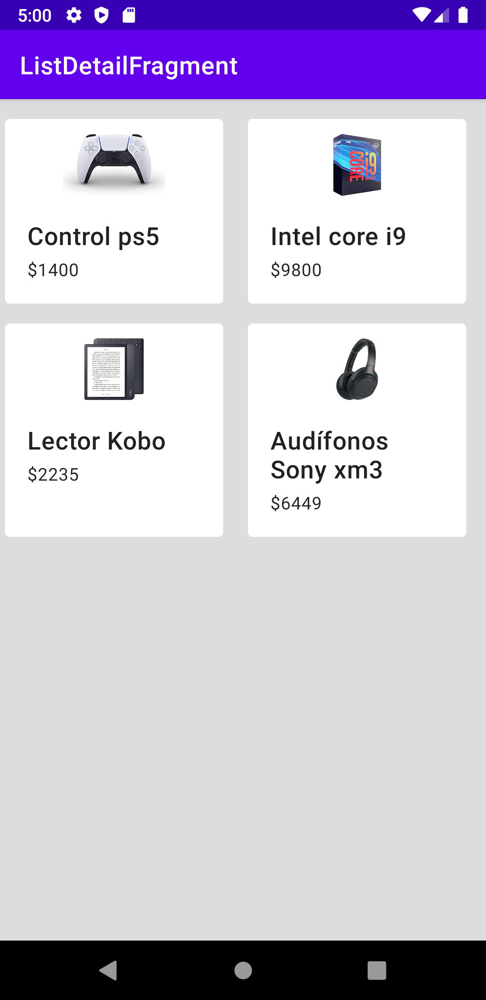

[`Kotlin Intermedio`](../../Readme.md) > [`Sesión 6`](../Readme.md) > `Reto 1`
	
## Reto 1

<div style="text-align: justify;">

### 1. Objetivos :dart:

- Implementar Material Design en un ejemplo.

### 2. Requisitos :clipboard:

- Android Studio instalado

### 3. Desarrollo :computer:

Ahora pondrás en práctica lo visto durante el ejemplo anterior.

Para completar este reto generá una nueva pantalla que contenga 4 CardView, puedes agregar los 4 cards o implementarlos con un RecyclerView.

El listado quedará de la siguiente forma:

 

Por practicidad, únicamente se tomará en cuenta el layout en versión móvil en vertical.

#### Tips:

- Para una separación entre layouts, creamos la siguiente clase que actuará como _Decorator_ en nuestro _Adapter_.

    ```kotlin
    class GridDecoration(private val largePadding: Int, private val smallPadding: Int) : RecyclerView.ItemDecoration() {

        override fun getItemOffsets(outRect: Rect, view: View,
                                    parent: RecyclerView, state: RecyclerView.State) {
            outRect.left = smallPadding
            outRect.right = largePadding
            outRect.bottom = largePadding;

            // Add top margin only for the first item to avoid double space between items
            if (parent.getChildLayoutPosition(view) == 0 || parent.getChildLayoutPosition(view)==1) {
                outRect.top = largePadding;
            } else {
                outRect.top = 0;
            }
        }
    }
    ```

    y así queda su implementación en el _RecyclerView_

    ```kotlin
    val largePadding = resources.getDimensionPixelSize(R.dimen.product_grid_spacing)
    val smallPadding = resources.getDimensionPixelSize(R.dimen.product_grid_spacing_small)
    recyclerProducts.addItemDecoration(GridDecoration(largePadding, smallPadding))
    ```

- Todos los elementos de _item_contact_ que son _atados_ al Producto, deben existir (incluso si no son visibles), de lo contrario esto nos puede generar un error en el código.

- Utilizar _CardView_ sin elevación.

<br/>

<details><summary>Solución</summary>

```xml
<?xml version="1.0" encoding="utf-8"?>
<RelativeLayout xmlns:android="http://schemas.android.com/apk/res/android"
    xmlns:app="http://schemas.android.com/apk/res-auto"
    android:layout_width="match_parent"
    android:layout_height="match_parent">

    <View
        android:id="@+id/center"
        android:layout_width="1dp"
        android:layout_height="1dp"
        android:layout_centerHorizontal="true" />

    <com.google.android.material.card.MaterialCardView
        android:id="@+id/card1"
        android:layout_width="match_parent"
        android:layout_height="wrap_content"
        android:layout_alignParentStart="true"
        android:layout_margin="4dp"
        android:layout_toStartOf="@+id/center"
        app:cardBackgroundColor="@android:color/white"
        app:cardElevation="0dp">

        <LinearLayout
            android:layout_width="match_parent"
            android:layout_height="wrap_content"
            android:orientation="vertical"
            android:paddingTop="12dp">

            <ImageView
                android:id="@+id/imgProduct"
                android:layout_width="match_parent"
                android:layout_height="150dp"
                android:background="@color/black"
                android:scaleType="fitCenter" />

            <LinearLayout
                android:layout_width="match_parent"
                android:layout_height="wrap_content"
                android:orientation="vertical"
                android:padding="16dp">

                <TextView
                    android:layout_width="match_parent"
                    android:layout_height="wrap_content"
                    android:padding="2dp"
                    android:text="Titulo"
                    android:textAppearance="?attr/textAppearanceHeadline6" />

                <TextView
                    android:layout_width="match_parent"
                    android:layout_height="wrap_content"
                    android:padding="2dp"
                    android:text="Descripción"
                    android:textAppearance="?attr/textAppearanceHeadline6"
                    android:visibility="gone" />

                <TextView
                    android:layout_width="match_parent"
                    android:layout_height="wrap_content"
                    android:padding="2dp"
                    android:text="$100"
                    android:textAppearance="?attr/textAppearanceBody2" />
            </LinearLayout>
        </LinearLayout>
    </com.google.android.material.card.MaterialCardView>

    <com.google.android.material.card.MaterialCardView
        android:id="@+id/card2"
        android:layout_width="match_parent"
        android:layout_height="wrap_content"
        android:layout_alignParentEnd="true"
        android:layout_margin="4dp"
        android:layout_toEndOf="@+id/center"
        app:cardBackgroundColor="@android:color/white"
        app:cardElevation="0dp">

        <LinearLayout
            android:layout_width="match_parent"
            android:layout_height="wrap_content"
            android:orientation="vertical"
            android:paddingTop="12dp">

            <ImageView
                android:layout_width="match_parent"
                android:layout_height="150dp"
                android:background="@color/black"
                android:scaleType="fitCenter" />

            <LinearLayout
                android:layout_width="match_parent"
                android:layout_height="wrap_content"
                android:orientation="vertical"
                android:padding="16dp">

                <TextView
                    android:layout_width="match_parent"
                    android:layout_height="wrap_content"
                    android:padding="2dp"
                    android:text="Titulo"
                    android:textAppearance="?attr/textAppearanceHeadline6" />

                <TextView
                    android:layout_width="match_parent"
                    android:layout_height="wrap_content"
                    android:padding="2dp"
                    android:text="Descripción"
                    android:textAppearance="?attr/textAppearanceHeadline6"
                    android:visibility="gone" />

                <TextView
                    android:layout_width="match_parent"
                    android:layout_height="wrap_content"
                    android:padding="2dp"
                    android:text="$100"
                    android:textAppearance="?attr/textAppearanceBody2" />
            </LinearLayout>
        </LinearLayout>
    </com.google.android.material.card.MaterialCardView>

    <com.google.android.material.card.MaterialCardView
        android:id="@+id/card3"
        android:layout_width="match_parent"
        android:layout_height="wrap_content"
        android:layout_below="@+id/card1"
        android:layout_alignParentStart="true"
        android:layout_margin="4dp"
        android:layout_toStartOf="@+id/center"
        app:cardBackgroundColor="@android:color/white"
        app:cardElevation="0dp">

        <LinearLayout
            android:layout_width="match_parent"
            android:layout_height="wrap_content"
            android:orientation="vertical"
            android:paddingTop="12dp">

            <ImageView
                android:layout_width="match_parent"
                android:layout_height="150dp"
                android:background="@color/black"
                android:scaleType="fitCenter" />

            <LinearLayout
                android:layout_width="match_parent"
                android:layout_height="wrap_content"
                android:orientation="vertical"
                android:padding="16dp">

                <TextView
                    android:layout_width="match_parent"
                    android:layout_height="wrap_content"
                    android:padding="2dp"
                    android:text="Titulo"
                    android:textAppearance="?attr/textAppearanceHeadline6" />

                <TextView
                    android:layout_width="match_parent"
                    android:layout_height="wrap_content"
                    android:padding="2dp"
                    android:text="Descripción"
                    android:textAppearance="?attr/textAppearanceHeadline6"
                    android:visibility="gone" />

                <TextView
                    android:layout_width="match_parent"
                    android:layout_height="wrap_content"
                    android:padding="2dp"
                    android:text="$100"
                    android:textAppearance="?attr/textAppearanceBody2" />
            </LinearLayout>
        </LinearLayout>
    </com.google.android.material.card.MaterialCardView>

    <com.google.android.material.card.MaterialCardView
        android:id="@+id/card4"
        android:layout_width="match_parent"
        android:layout_height="wrap_content"
        android:layout_below="@+id/card2"
        android:layout_alignParentEnd="true"
        android:layout_margin="4dp"
        android:layout_toEndOf="@+id/center"
        app:cardBackgroundColor="@android:color/white"
        app:cardElevation="0dp">

        <LinearLayout
            android:layout_width="match_parent"
            android:layout_height="wrap_content"
            android:orientation="vertical"
            android:paddingTop="12dp">

            <ImageView
                android:layout_width="match_parent"
                android:layout_height="150dp"
                android:background="@color/black"
                android:scaleType="fitCenter" />

            <LinearLayout
                android:layout_width="match_parent"
                android:layout_height="wrap_content"
                android:orientation="vertical"
                android:padding="16dp">

                <TextView
                    android:layout_width="match_parent"
                    android:layout_height="wrap_content"
                    android:padding="2dp"
                    android:text="Titulo"
                    android:textAppearance="?attr/textAppearanceHeadline6" />

                <TextView
                    android:layout_width="match_parent"
                    android:layout_height="wrap_content"
                    android:padding="2dp"
                    android:text="Descripción"
                    android:textAppearance="?attr/textAppearanceHeadline6"
                    android:visibility="gone" />

                <TextView
                    android:layout_width="match_parent"
                    android:layout_height="wrap_content"
                    android:padding="2dp"
                    android:text="$100"
                    android:textAppearance="?attr/textAppearanceBody2" />
            </LinearLayout>
        </LinearLayout>
    </com.google.android.material.card.MaterialCardView>

</RelativeLayout>
```
</details>
<br/>

[`Anterior`](../Ejemplo-01/Readme.md) | [`Siguiente`](../Ejemplo-02/Readme.md)


</div>
