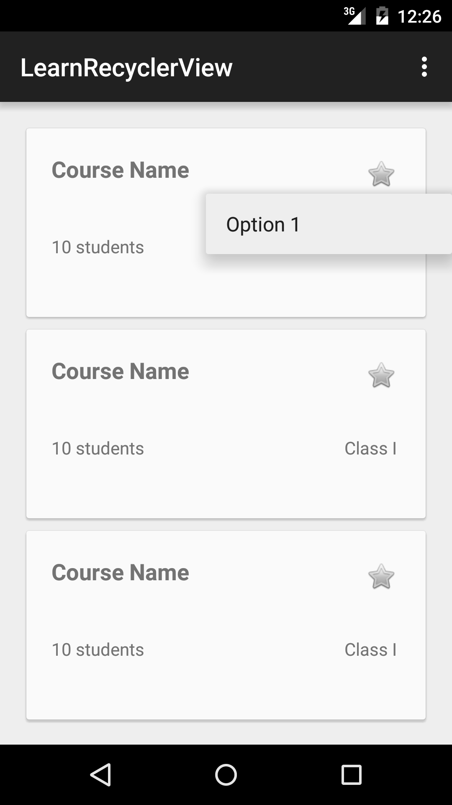
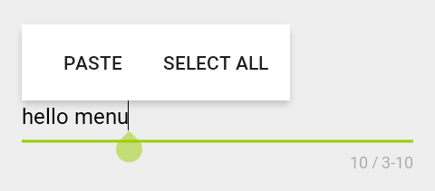
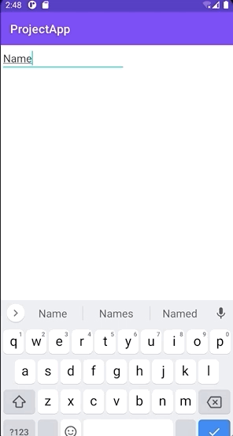

[`Kotlin Intermedio`](../../Readme.md) > [`Sesión 07`](../Readme.md) > `Proyecto`

## Proyecto: Menús y RecyclerView

> <div style="text-align: justify;">

### 1. Objetivos :dart:

- Implementar el uso de Menús Contextuales y Menús Flotantes.

### 2. Requisitos :clipboard:

1. Android Studio Instalado en nuestra computadora.


### 3. Desarrollo :computer:

Hasta este punto tu proyecto debe tener una vista de RecyclerView con CardViews. Ahora permirás la edición de elementos al seleccionar una celda.

- Las acciones sugeridas a ejecutar son:

	- Duplicar
	- Eliminar
	- Editar

	

Al seleccionar una opción de menú debe verse actualizado el `RecyclerView`.
Si se implementa la opción de Editar, debe mostrar una nueva vista para editar la información.

### Flujo

El flujo del proyecto comienza con la **Vista-A**, un recycler view. al seleccionar una fila o celda, ira a la vista de detalle **Vista-B** en donde el título de la celda tendrá uno o varios campos de texto para poder editar su informacion. Con un botón guardaremos la información y regresaremos a la **Vista-A**.

Flujo:

```
**Vista-A** -----[ editar ]--->| **Vista-B**
**Vista-B** |<---[guardar y actualizar]--- **Vista-A**
```

En las opciones de cada campo de texto, implementa un menú contextual con opciones propias. Estas opciones serán diferentes a Copiar, Pegar, Cortar texto. Se sugiere algo como, verificar correo electronico, poner texto en mayusculas, compartir en alguna red social.







### Lineamientos

1. Implementa al menos dos vistas en el proyecto.
2. Cualquier forma de implementación de _recyclerview_ es válida.
3. Usa almenos dos tipos de menús contextuales en el proyecto, con opciones propias.
4. Uno de los menús sera creado por XML y otro sin XML.


#### Checklist

Asegúrate de que tu entregable contiene cada uno de los elementos enlistados a continuación:

- [ ] Dos opciones diferentes de menú
- [ ] Un menú creado por XML
- [ ] Un menú creado sin XML


[`Anterior`](../Reto-03/Readme.md) | [`Siguiente`](../../Sesion-08/Readme.md)

</div>
