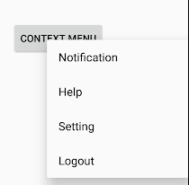
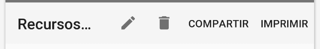

[`Kotlin-Intermedio`](../Readme.md) > `Sesión 7`

## Sesión 7: Menús

> 

  
### 1. Objetivos :dart: 

- Manejar eventos y cambio de elementos en tiempo de ejecución.

### 2. Contenido :blue_book:

---

 

#### <ins>Tipos de menús en Android</ins>

Implementaremos los tres tipos de menú en Android: Popup, Contextual y Opciones, abarcando desde la interfaz gráfica con grupos de elementos, hasta la creación mediante código.

- [**`EJEMPLO 1`**](Ejemplo-01/Readme.md)
- [**`RETO 1`**](Reto-01/Readme.md)

---

 

 

#### <ins>Menús y Eventos</ins>

Crearemos menús que sean capaces de ejecutar acciones.

- [**`EJEMPLO 2`**](Ejemplo-02/Readme.md)
- [**`RETO 2`**](Reto-02/Readme.md)

---

 

#### <ins>Action Modes</ins>

Implementaremos Action Modes para crear menús contextuales flotantes.

- [**`EJEMPLO 3`**](Ejemplo-03/Readme.md)
- [**`RETO 3`**](Reto-03/Readme.md)

---

### 3. Proyecto :hammer:

Con lo aprendido en esta sesión, continúa con la implementación de _Menús_ en tu proyecto.

- [**`PROYECTO SESIÓN 7`**](Proyecto/Readme.md)

 

[`Anterior`](../Sesion-06/Readme.md) | [`Siguiente`](../Sesion-08/Readme.md)      

