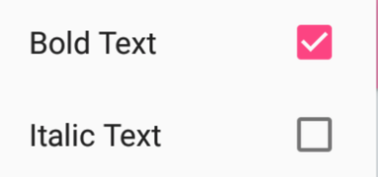
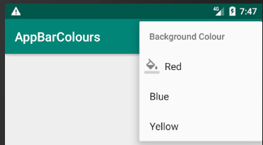

[`Kotlin Intermedio`](../../Readme.md) > [`Sesión 07`](../Readme.md) > `Reto 1`

## Reto 1: Agregando funcionalidad a los Menús

### 1. Objetivos :dart:

- Agregar mas elementos a los menús de opciones

### 2. Requisitos :clipboard:

1. Android Studio 4.1
2. Kotlin 1.3
3. AVD Virtual device con API 11 (Android 3.0) o superior
4. Conexión a internet

### 3. Desarrollo :computer:

Ahora toca poner en marca lo que aprendiste en el ejemplo anterior.

Para completar este reto realiza los siguientes puntos:

1. Agrega un CheckBox en cada elemento del menú.

    

2. Habilita la función mostrar iconos en cada opción de menú.

    

3. Agrega tantas opciones quieras, siempre creando agrupaciones.

[`Anterior`](../Ejemplo-01/Readme.md) | [`Siguiente`](../Ejemplo-02/Readme.md)

